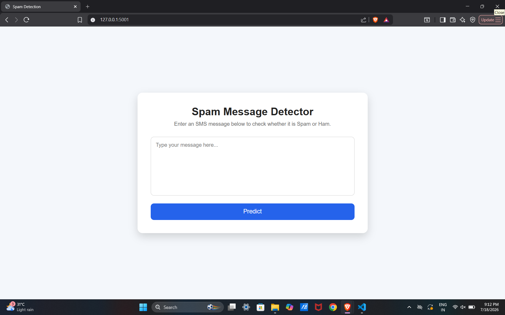
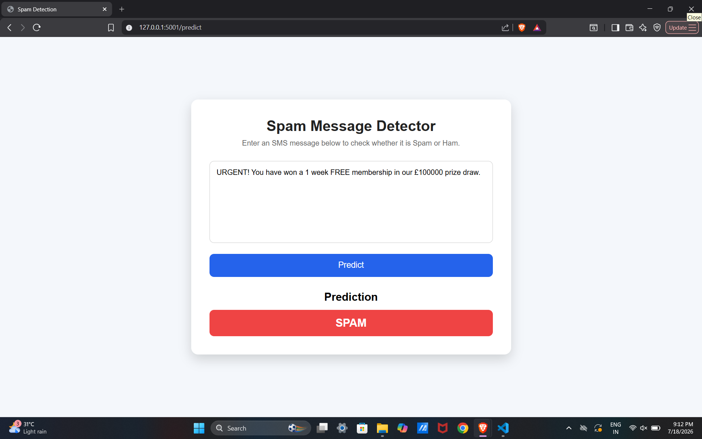
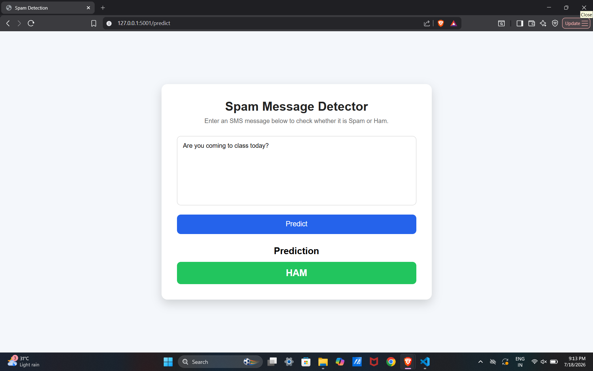

# SMS Spam Detection System
--- 

This is the github repository created for the End to End Machine Learning project done by: Satvik 
[ Data Source ](https://www.kaggle.com/datasets/abdallahwagih/spam-emails)

A Machine Learning web application that classifies SMS messages as **Spam** or **Ham (Not Spam)** using Logistic Regression.

The application provides a simple web interface built with Flask where users can enter an SMS message and instantly receive a prediction.

---

## Project Overview

Spam messages are one of the most common forms of unwanted communication. This project aims to automatically detect whether an SMS message is spam or legitimate using Machine Learning techniques.

Model used : Logistic Regression 

Evaluation Metrics:
- Accuracy
- Precision
- Recall
- F1 Score

---

## Screenshots

### Home Page

### Spam Prediction

 
### Ham Prediction

